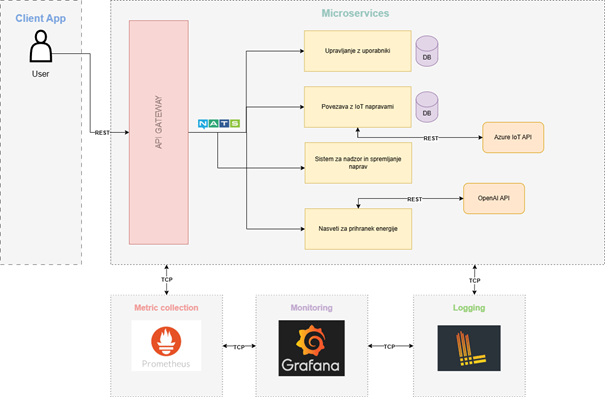

# Energy Management System for Smart Homes

**Cloud Computing Services**  
**Žiga Črv, Rok Rajher**  
**Academic Year 2024/25**  
**Faculty of Computer and Information Science, University of Ljubljana**

---

## Application Idea

As part of the project, we developed a web application that provides users with a comprehensive view of the measurements from their devices registered on Azure IoT Hub. Based on these measurements, the application offers smart suggestions for optimizing consumption via the OpenAI API.

## Planned Features

- **Authentication Service:**  
  We will ensure user authentication using JWT for session management.

- **IoT Device Connection:**  
  Devices will be connected via Azure IoT Hub, from which we will retrieve their data.

- **Monitoring and Management System:**  
  We will develop a service that allows users to monitor and control smart devices through a REST API.

- **Energy-Saving Recommendations:**  
  A microservice will be implemented using the OpenAI API to provide insights into energy consumption based on collected data.

---

## Project Structure

The application is divided into two main folders:

1. **Frontend** (React.js)
2. **Backend** (Moleculer.js)
3. **Documentation** (Swagger)
4. **Database** (PostgreSQL)
5. **CI/CD** (GitHub Actions)
6. **Testing** (Jest)
7. **Deployment** (Kubernetes, Google Cloud Run, Docker Hub, Azure IoT Hub)

Image of the Architecture Schema:



---

## How to Run the Project

### Backend

1. Navigate to the `backend` folder.

```bash
cd backend
```

3. Install dependencies:

```bash
npm install
```

3. Rename the `.env.example` file to `.env` and fill in the required environment variables.
4. Start the application:

```bash
npm run dev
```

### Frontend

1. Navigate to the `frontend` folder.
   
```bash
cd frontend
```

2. Install dependencies:

```bash
npm install
```

3. Go to the `frontend/src/app/(general)/utils/baseUrl.js` file and change the baseUrl to the address of the backend server.
4. Build the project:

```bash
npm run build
```

5. Start the application:

```bash
npm run start
```

---

## Use Case

All the services are interconnected. The user must first register to be able to log in. The user must be logged in to view their dashboard. The user can only see their own devices from the IoT Azure Hub. For these devices, they can then monitor detailed information on a graph. Finally, they can ask the AI model for recommendations on reducing energy consumption based on the device data or not. At the end, the user can log out of the application.

---

## Testing

We have implemented unit tests for the backend services.
We tested the services using the Jest testing framework.
In unit tests, we tested the individual functions of the services.
In integration tests, we tested the communication between services.

To run the tests, navigate to the `backend` folder and run the following command:

```bash
npm run test
```

---

## API Documentation

Microservices are documented using Swagger.

Our microservises:

- Users
- Devices
- Monitoring
- Gpt
- IoT (IoT is used to deploy the IoT devices to Azure IoT Hub. For that we use script `populate.js` in the `backend` folder.
  Here you need to specific the connection string to your Azure IoT Hub Device to generate data for the devices.)

To access the documentation, navigate to the following URL: **[http://157.230.78.156:3000/api/openapi/ui](http://157.230.78.156:3000/api/openapi/ui)**.

---

## Collecting metrics ( Grafana )

We integrated Grafana with (1) Prometheus to collect metrics and (2) with Loki, to collect logs from all microservices.

Grafana is exposed inside a cluster with the following command.

```bash
 kubectl port-forward deployment/my-prom-grafana 3000 -n monitoring
```
After running the command, the Grafana interface is available on **[http://localhost:3000/login](http://localhost:3000/login)**

To login, enter the following information:

Grafana user: **admin**

Grafana password: **prom-operator**

---

## Health Check

Health and readiness checks were implemented for each microservice seperatly at the following endpoints:


### Devices

**[http://157.230.78.156:3000/api/v1/devices/ready](http://157.230.78.156:3000/api/v1/devices/ready)**

**[http://157.230.78.156:3000/api/v1/devices/live](http://157.230.78.156:3000/api/v1/devices/live)**

### Gpt
**[http://157.230.78.156:3000/api/v1/gpt/ready](http://157.230.78.156:3000/api/v1/gpt/ready)**

**[http://157.230.78.156:3000/api/v1/gpt/live](http://157.230.78.156:3000/api/v1/gpt/live)**

### Users
**[http://157.230.78.156:3000/api/v1/users/health/ready](http://157.230.78.156:3000/api/v1/users/health/ready)**

**[http://157.230.78.156:3000/api/v1/users/health/live](http://157.230.78.156:3000/api/v1/users/health/live)**

### Monitoring
**[http://157.230.78.156:3000/api/v1/monitoring/ready](http://157.230.78.156:3000/api/v1/monitoring/ready)**

**[http://157.230.78.156:3000/api/v1/monitoring/live](http://157.230.78.156:3000/api/v1/monitoring/live)**

---

## Updating project code

To update the project code, you need to follow these steps:

1. Pull the latest changes from the main branch.
2. Run the following command to install the dependencies:

```bash
cd backend
npm install

cd ..

cd frontend
npm install
```

3. Create a new branch for your changes.
4. Make the necessary changes.
5. Make sure that application builds succesffuly with following command:
```bash
npm run build
```
6. Run the tests to ensure that everything is working correctly:

```bash
cd backend
npm run test
```

6. Commit your changes and push them to the repository.
7. Create a pull request to merge your changes into the main branch.
8. Wait for the code to be reviewed and merged.
9. Once the code is merged, the code will be automatically deployed to the production environment.
10. Verify that the changes are working correctly in the production environment.
11. The project code has been successfully updated.

---

## Deployment

Backend is deployed on Kubernetes, while the frontend is deployed on Google Cloud Run.
The application is live and accessible at: **[https://sistem-za-upravljanje-energije-91846956206.europe-west3.run.app](https://sistem-za-upravljanje-energije-91846956206.europe-west3.run.app/login)**.
Backend is accessible at: **[http://157.230.78.156:3000/](http://157.230.78.156:3000/)**.

Please note: For the backend to function properly, you may need to enable the option to allow insecure content in your browser settings.

---

## License

This project is licensed under the [GNU General Public License, version 3 (or later)](http://www.gnu.org/licenses/). This means it can be freely distributed and/or modified under the conditions of this license. Detailed license information can be accessed on the following website: http://www.gnu.org/licenses/.
